# Persistent UTM Capture for Gravity Forms (WordPress + GTM)

This is a client-side UTM and click ID capture script I built for a WordPress site using:

- Google Tag Manager
- Gravity Forms
- AJAX-rendered forms
- aggressive page caching
- duplicate form markup on mobile

The goal was to keep attribution data available across page navigation and return visits, then write it into Gravity Forms hidden fields before submit.

## What it does

This script:

- reads UTM and click ID values from the URL
- stores them in `localStorage`
- keeps attribution data for 60 days
- tracks the current and previous internal page
- injects values into Gravity Forms hidden fields
- re-injects after Gravity Forms AJAX render
- re-injects again right before form submit as a safeguard

## Why I built it

When I started on this site, nothing existed for first-party attribution capture. The client was mainly relying on Google Ads in-platform attribution reporting.

My first attempt worked, but it only saved values to session storage, which meant attribution data could be lost on navigation or later visits.

This version was built to make attribution more persistent and more reliable in a real-world setup where:

- forms exist multiple times on the page
- mobile had duplicate form IDs in the DOM
- forms rerender through Gravity Forms AJAX
- caching makes server-side assumptions unreliable

## Data captured

The script currently captures:

- `utm_source`
- `utm_medium`
- `utm_campaign`
- `utm_term`
- `utm_content`
- `gclid`
- `fbclid`
- `request_uri`
- `http_referer`

## Storage model

The script uses two `localStorage` objects:

### 1. Attribution state
Stores the last-touch attribution data:

- UTMs
- click IDs
- external referrer
- update timestamp
- expiry timestamp

### 2. Nav state
Stores:

- current internal page
- previous internal page
- update timestamp

## Logic rules

### Attribution overwrite
A new attribution object is only created when a **core UTM touch** is detected (i.e., a real campaign visit).
Practically: utm_soruce, utm_medium, utm_campaign must be present; utm_term/utm_content are optional.

- `utm_source`
- `utm_medium`
- `utm_campaign`
- `utm_term`
- `utm_content`

This was important because `gclid` sometimes persisted on internal navigation, and I did not want that to wipe out valid stored UTMs.

### `request_uri`
The script uses:

- previous internal page if available
- otherwise current page

That gives useful values for both:
- first-page submits
- multi-page journeys

### `http_referer`
This is best-effort only.

If `document.referrer` is available and external, it gets stored on the attribution touch. If it is blank, it stays blank.

## Gravity Forms handling

This script had to deal with a messy form setup:

- desktop and mobile forms had different behaviors
- mobile included duplicate form markup in the DOM
- one mobile form ID existed multiple times

Because of that, I had to use `querySelectorAll()` instead of `getElementById()` for hidden field injection so all matching fields could be populated.

## Main implementation challenges

The hardest parts were:

- GTM script compatibility and syntax issues
- duplicate form/input IDs in the DOM
- Gravity Forms AJAX rerendering
- keeping attribution persistent without overwriting valid state
- separating attribution state from page navigation state

## Testing completed

I tested the script against these flows:

1. Landing page submit
2. Landing page → internal page → submit
3. Return visit without UTMs
4. New UTM touch overwriting previous stored attribution

I also tested:
- desktop top form
- desktop bottom form
- mobile form
- duplicate mobile DOM instances

## Proof (screenshots)
These tests validate that the script correctly:
- Uses a per form field map (FORM_FIELD_MAP) to support mutiple GF forms with different IDs
- Field injection loop: injects hidden field values by constructing GF input IDs (input_<formID>_<fieldId>) and repopulating all matching DOM nodes (mobile duplicates)
- Captures first touch UTMS/GCLID from an initial landing URL
- Persists attribution across internal navigation (multi-page journeys)
- Overwrites attribution when a new tagged session occurs (last touch wins)
**Note: GF "Embed URL" shows the page the user submitted the form on**

### Test URLs
- Test URL (A):
```https://innovativeawnings.com/retractable-patio-awnings/?utm_source=google&utm_medium=cpc&utm_campaign=utm_capture_test_A&utm_term=retractable%20patio%20awnings&utm_content=ad_a&gclid=TEST-GCLID-A```

- Test URL (B):
```https://innovativeawnings.com/all-season-pergola-systems/?utm_source=google&utm_medium=cpc&utm_campaign=utm_capture_test_B&utm_term=all%20season%20pergola&utm_content=ad_b&gclid=TEST-GCLID-B```


### Field map object + injection loop

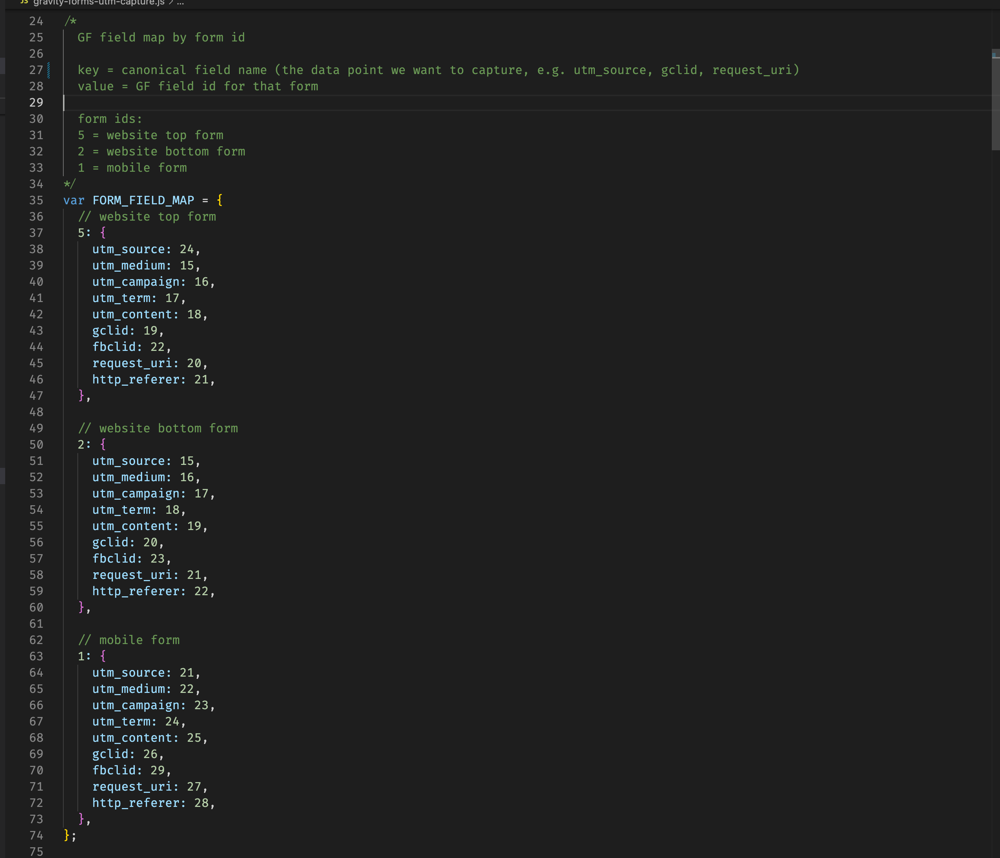
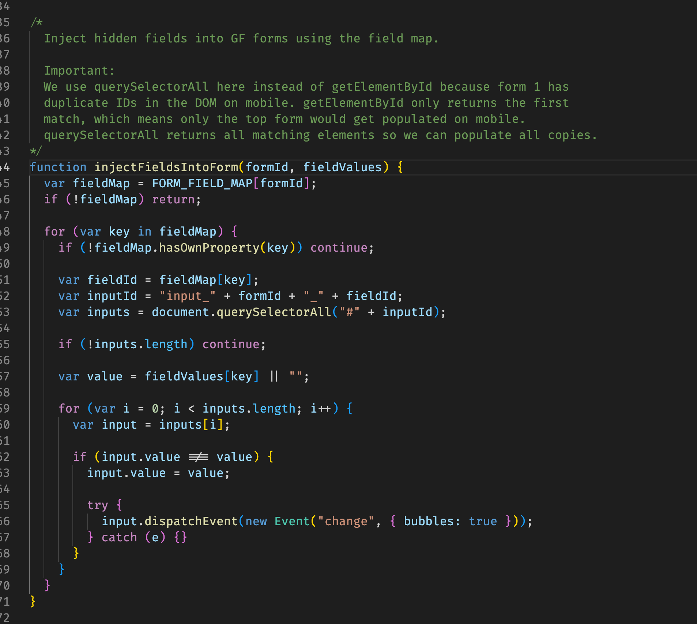

### Test 1 - Landing page submit (flow 1)
Confirms first-touch capture on a tagged landing page submit:
- UTM fields match the landing URL querystring
- request_uri = landing page (no prior internal page exists)
- Gravity Forms Source URL = submit page

**Steps: UTM tagged LP (Test URL A) -> submit from LP**

**Start state desktop (localstorage):**
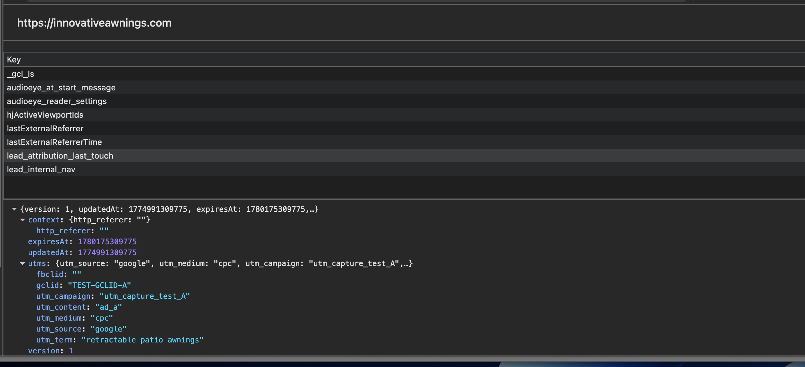
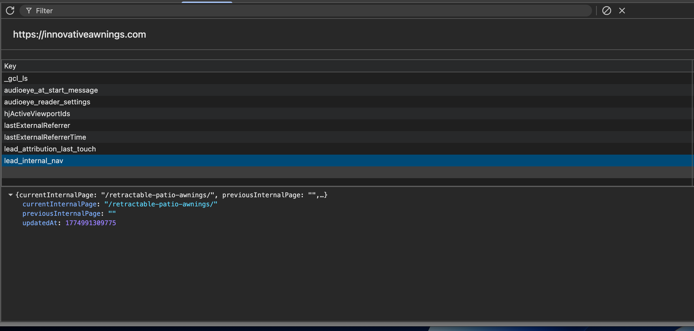

**Start start mobile (localstorage):**
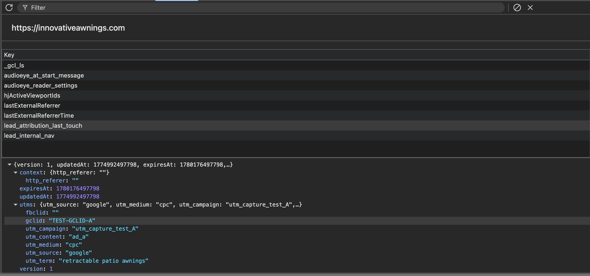
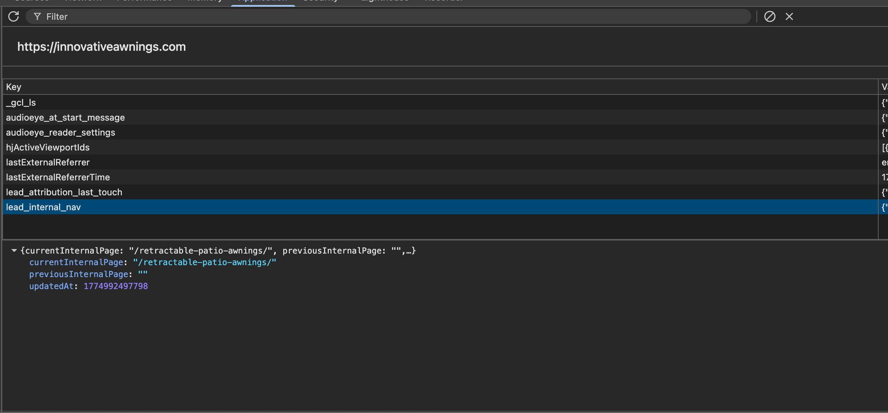

**GF entry desktop:**
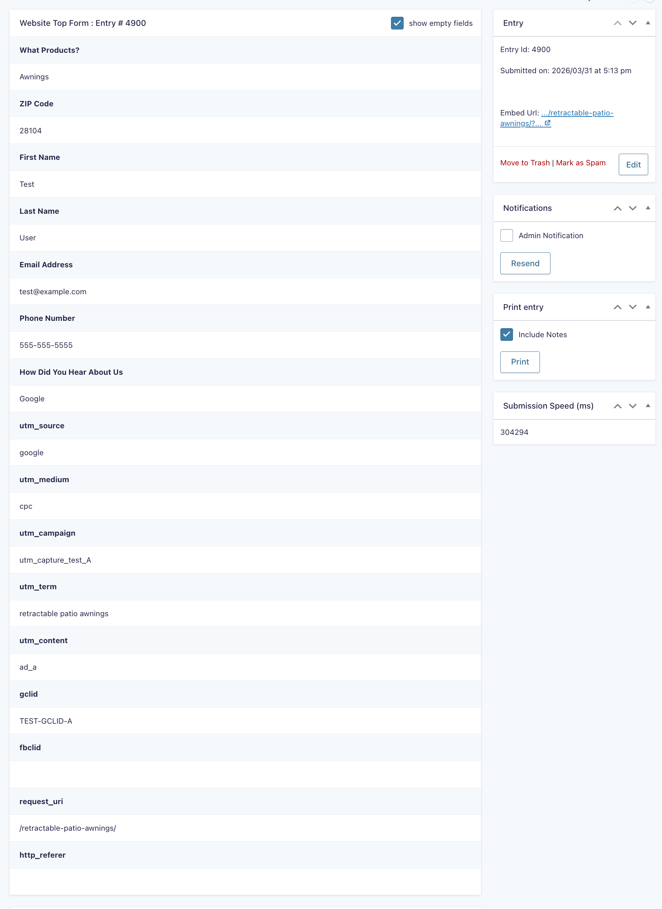

**GF entry mobile:**
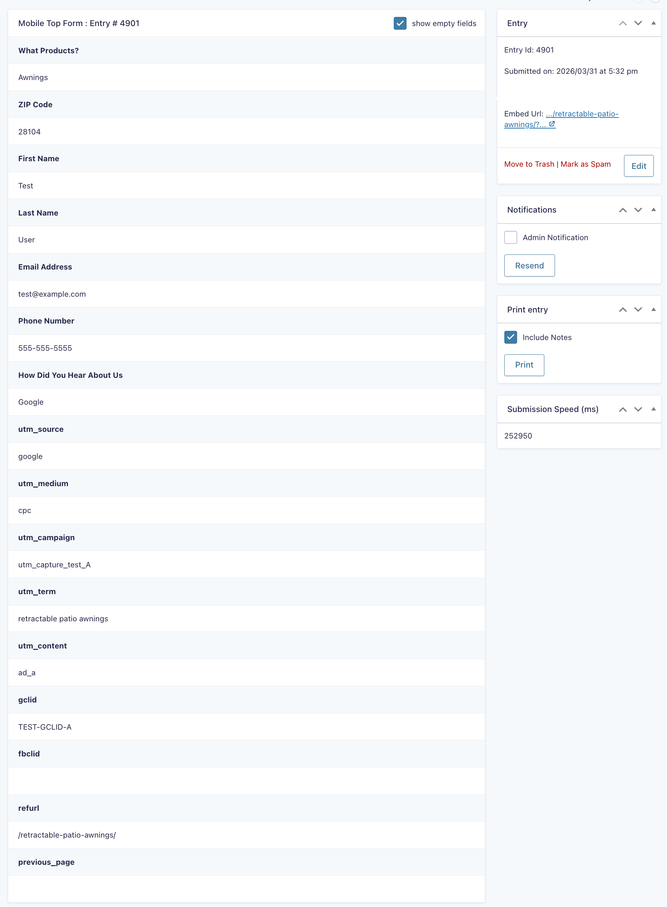

### Test 2 - Landing page -> nav internal page -> submit (flow 2)
Confirms persistence across internal navigation:
- UTM fields still match the original landing URL (no overwrite)
- request_uri = previous internal page before the submit page
- Gravity Forms Source URL = submit page

**Steps: UTM tagged LP (Test URL A) -> navigate internally -> submit**

**Precondition (localstorage after Test 1):**


**Submit state (localstorage):**
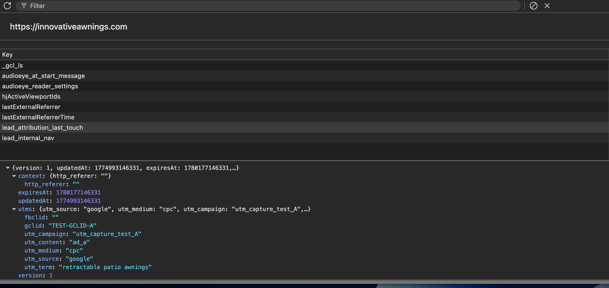
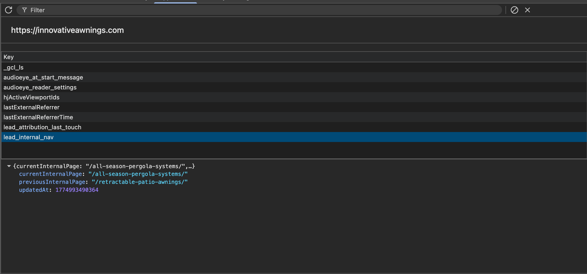

**GF entry:**
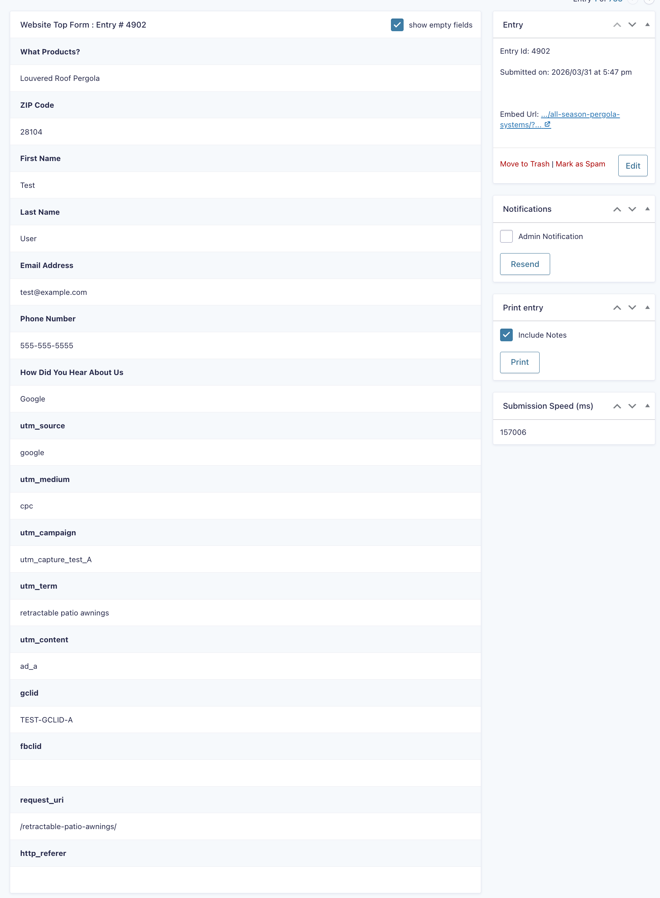

### Test 3 - Return visit without UTMs (flow 3)
Confirms stored attribution is reused when a user returns without UTMs:
- Stored UTM fields remain populated from the prior session
- request_uri reflects the most recent internal navigation state
- No overwrite occurs without a new core UTM touch

**Steps: Use Test URL A -> nav off site -> revisit site with no UTMs → navigate → submit**

**Precondition (localstorage after Test 1):**


**Submit state (localstorage):**
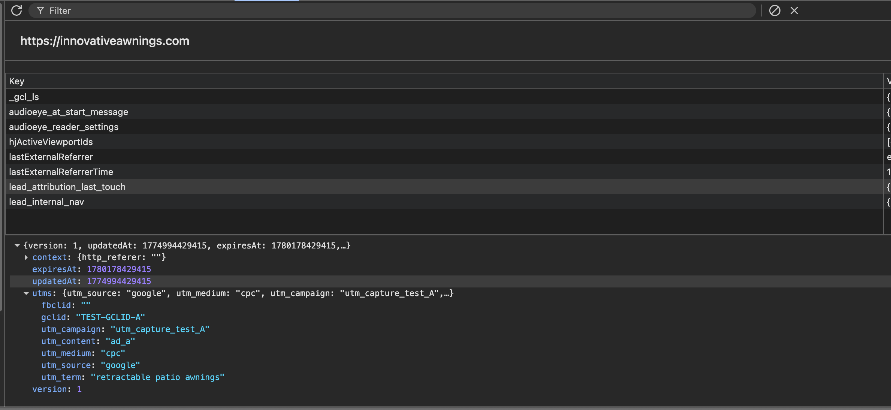
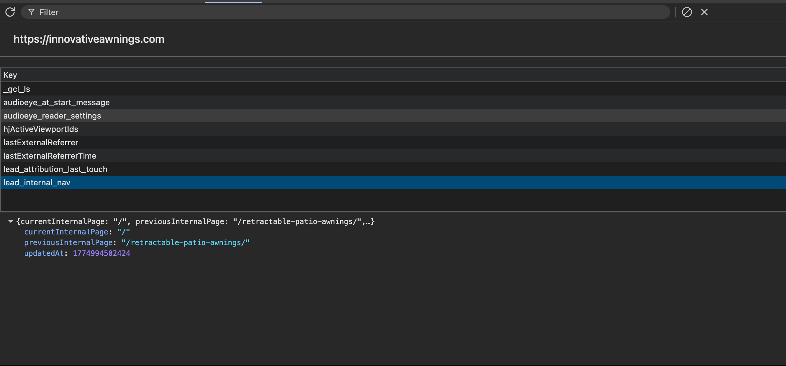

**GF entry:**
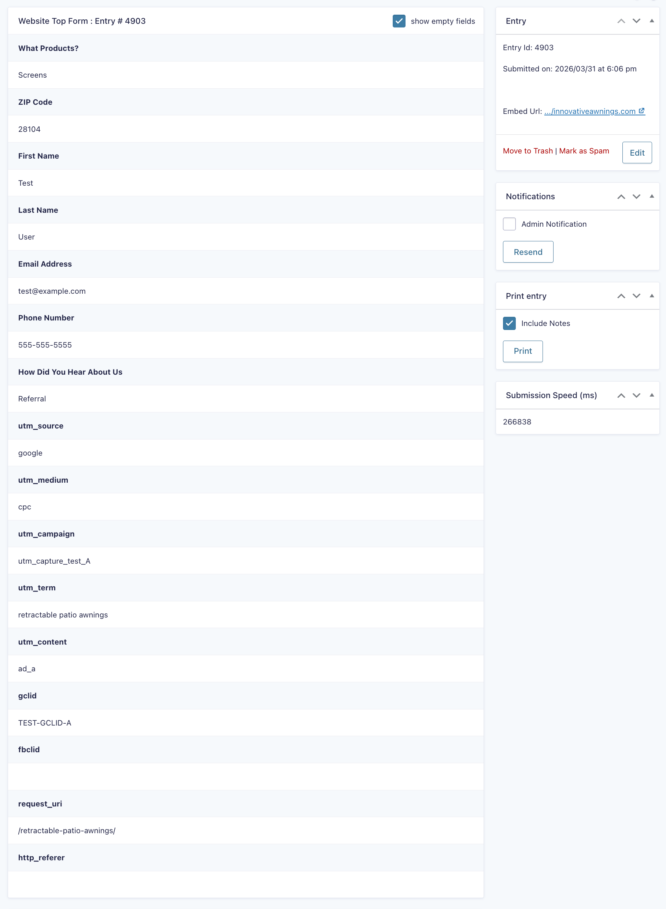

### Test 4 - New core UTM touch overwrites stored attribution (flow 4)
Confirms overwrite only happens on a core UTM touch (utm_source, utm_medium, utm_campaign, utm_term, utm_content), not on gclid alone:
- UTM fields update to the new tagged session
- request_uri matches the last internal page prior to submit
- Gravity Forms Source URL = submit page

**Steps: Use Test URL A -> nav off site -> revisit the site with new UTMS (Test URL B) -> navigate if you'd like -> submit**

**Precondition (localstorage after Test 1):**


**Submit state(localstorage):**
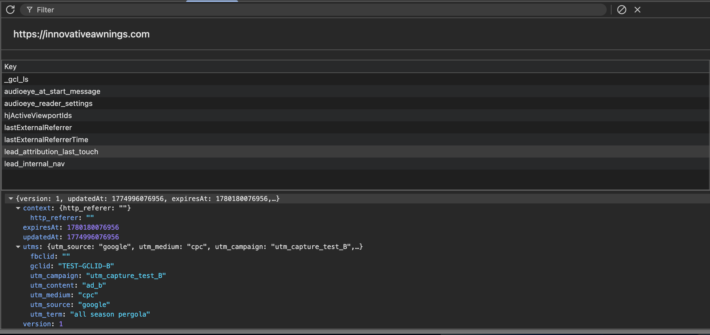
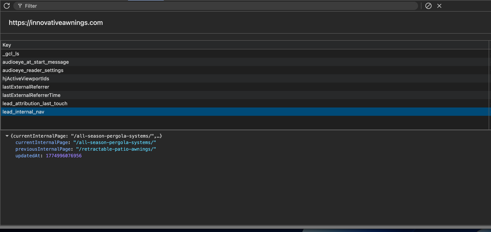

**GF entry:**
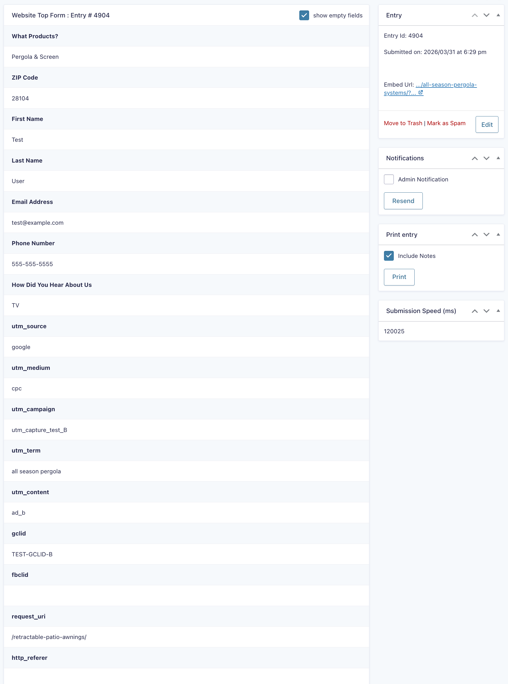

## Files

- `gravity-forms-utm-capture.js` → stable working version of the script

## Scope

This is not meant to be a polished package or plugin.
It is a practical attribution script built for a real client site with real constraints.

The main focus was reliability, persistence, and surviving messy markup / AJAX form behavior.

## Next Steps
Next improvement:
- add basic organic / referral traffic classification when UTMs are not present

Example future logic:
- detect 'organic_google' , 'organic_bing', 'referral', or 'direct'
- store that value alongside the existing attribution object
- write it into a hidden field for Gravity Forms
